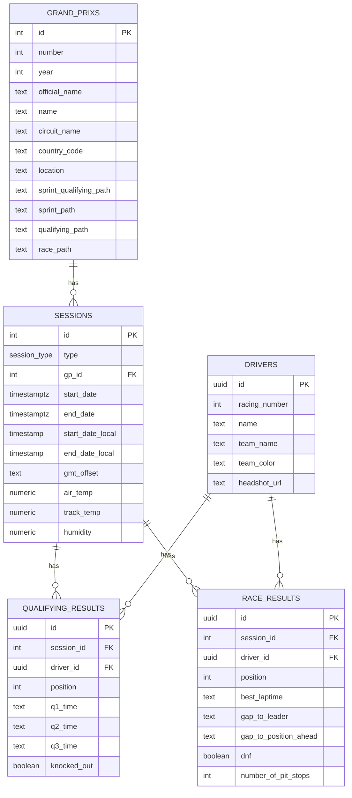

# F1 Data

> **Disclaimer:** This is an unofficial, fan-made project built for personal/educational use.
> It is not affiliated with, endorsed by, or connected in any way to Formula 1, Formula One
> Management, the FIA, or any F1 team, driver, or sponsor. All F1-related names, logos, and
> marks are the property of their respective owners. Data is sourced from F1's public
> live-timing feeds for non-commercial, informational use only.

## Scope

A browsable archive of Formula 1 season data: every Grand Prix weekend (race, qualifying, and
sprint sessions where applicable) from 2018 onward, with results, weather, and timing pulled
from F1's own live-timing service into a local database.

The season/calendar grid view and the per-GP detail page (full qualifying/race classification
with Q1/Q2/Q3 breakdown, weather, and results tables) are both fully working end-to-end.

Live at [gpdata.app](https://gpdata.app/).

## Prerequisites

- [Node.js 26](https://nodejs.org/) (pinned in `.nvmrc` — `nvm use` will pick it up)
- [Docker](https://www.docker.com/) (for local Postgres via `docker-compose.yml`)
- npm

## How it works

**Data pipeline** — `lib/crawler/` fetches season and session data directly from F1's public
live-timing API (`https://livetiming.formula1.com/static/`): calendar, drivers, qualifying
results, race results, and weather, per Grand Prix. Data is normalized and upserted into
Postgres (schema in `migrations/`) via [Knex](https://knexjs.org/), so re-running the crawler
is safe and idempotent.

**UI** — a [Next.js](https://nextjs.org/) app reads directly from Postgres to render:
- a season grid (`/`) — one tile per race/sprint weekend, with round info, winner, pole,
  and weather at a glance, filterable by year
- a per-GP detail page (`/gp/[key]`) — full session breakdown: weather, a Qualifying/Race
  (or Sprint Qualifying/Sprint) tab switch, Q1/Q2/Q3 classification, and race results with
  gap/best lap/pit stops/fastest-lap badge

### Database schema



`grand_prixs` and `sessions` use F1's own numeric IDs as primary keys (not generated); `drivers`,
`qualifying_results`, and `race_results` use generated UUIDs. See `migrations/` for the full DDL.

## How to run it

1. Install the pinned Node version and dependencies:
   ```bash
   nvm use
   npm install
   ```
2. Start Postgres:
   ```bash
   docker compose up -d
   ```
3. Run migrations to create the schema:
   ```bash
   npm run migrate
   ```
4. Hydrate the database with real F1 data (one year, or every available year):
   ```bash
   npm run hydrate -- 2026        # single season
   npm run hydrate-all            # every season in lib/years.ts
   ```
5. Start the app:
   ```bash
   npm run dev
   ```
   Visit [http://localhost:3000](http://localhost:3000).
